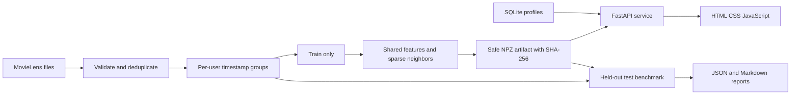

# Cine (cas) phile. 3.0

The API loads one engine per process. It does not execute uploaded model code, load pickles or train at startup. Metadata, popularity, user profiles, latent factors and sparse neighbor arrays are shared by all ranking modes. Profile changes are read for each request; SQLite transactions handle concurrent local writes. Ratings are never added to benchmark data automatically.

The service is intended for one local user. A profile UUID is a browser capability, not an authenticated identity. Default binding is loopback, and the frontend calls same-origin APIs. No CDN, analytics, external font or image request is necessary after dependencies are installed. Original hero and illustrative thumbnails are packaged locally.

The catalog's average ratings and Bayesian priors use TRAIN interactions only. The full historical metadata catalog is available for cold-start items. Temporal holdout respects strict user-level timestamp boundaries; it does not establish global-time causality across users.

The MMR parameter is exposed as exploration in the interface, from 0 to .6. At zero, rank order is preserved. At larger values, the highest genre similarity to already selected items is penalized. MMR is a heuristic over the initial candidate pool, not a guarantee about exposure fairness or recommendation quality.
